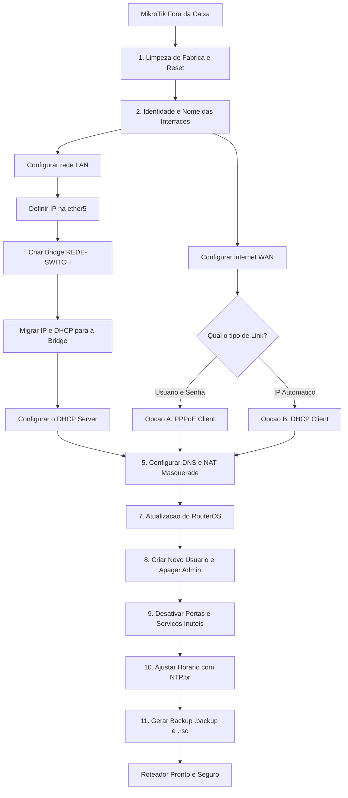

# 🗺️ Mapa de Fluxo da Configuração Inicial
{: .no_toc }

Este diagrama visual apresenta a sequência lógica e cronológica dos passos necessários para realizar a configuração do seu roteador MikroTik do zero.

---

### 📊 Diagrama de Fluxo (Ordem de Execução)

{: .note }
> Caso o diagrama não carregue imediatamente, certifique-se de atualizar a página com `Ctrl + F5`.

[⬅️ Voltar para o Guia de Configuração Inicial]({{ '/docs/primeiro-passos/configuracao-inicial/' | relative_url }}){: .btn .btn-outline }