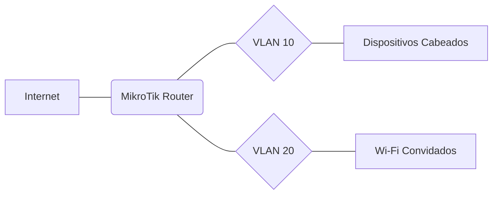
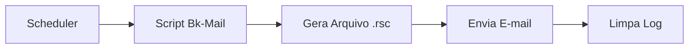

# 🛠️ Recursos Disponíveis na Wiki
Esta página demonstra as funcionalidades técnicas ativas na documentação para **RouterOS v7**.

---

## 1. Alertas Visuais (Callouts)
Use estes blocos para destacar informações críticas nos seus scripts e tutoriais.

{: .note }
> **Nota:** Use para informações complementares ou dicas de boas práticas.

{: .warning }
> **Atenção:** Use para configurações que podem causar queda de conexão ou perda de acesso.

{: .important }
> **Importante:** Use para requisitos obrigatórios antes de rodar um comando no Terminal.

---

## 2. Diagramas de Rede (Mermaid)
Você pode desenhar topologias e fluxos de pacotes diretamente via código.

## 3. Listas (Lists)
Úteis para organizar tarefas de configuração e glossários técnicos.

### Task List (Checklist de Configuração)
- [x] Configurar Identidade do Roteador (`/system identity`)
- [x] Configurar Usuário e Senha Forte
- [ ] Configurar Firewall Filter (Input/Forward)
- [ ] Ativar Backup Automático

### Definition List (Glossário)
<dl>
  <dt>Winbox</dt>
  <dd>Interface gráfica oficial para gerenciar o RouterOS.</dd>
  <dt>Fasttrack</dt>
  <dd>Recurso que acelera o encaminhamento de pacotes ignorando o processamento pesado do Firewall.</dd>
</dl>

---

## 4. Tabelas Responsivas (Tables)
Ideal para planos de endereçamento IP e mapeamento de portas.

| Interface | VLAN ID | Rede IP | Status |
|:----------|:--------|:--------|:-------|
| `ether2`  | 10      | `192.168.10.1/24` | ok |
| `ether3`  | 20      | `192.168.20.1/24` | ok |
| `ether4`  | 30      | `10.0.0.1/24` | `Manutenção` |

---

## 5. Rótulos (Labels)
Use para indicar versões, status de scripts ou compatibilidade.

Default label
{: .label }

Blue labe
{: .label .label-blue }

Stable
{: .label .label-green }

New release
{: .label .label-purple }

Coming soon
{: .label .label-yellow }

Deprecated
{: .label .label-red }

---

## 6. Botões (Buttons)
Transforme links em botões de ação para downloads ou referências externas.

### Cores de Botão
[Link Padrão](https://github.com/soarespaullo){: .btn }
[Link Roxo](https://github.com/soarespaullo){: .btn .btn-purple }
[Link Azul](https://github.com/soarespaullo){: .btn .btn-blue }
[Link Verde](https://github.com/soarespaullo){: .btn .btn-green }
[Link Outline](https://github.com/soarespaullo){: .btn .btn-outline }

### Tamanhos e Espaçamento
[Botão Grande](https://github.com/soarespaullo){: .btn .btn-blue }
[Botão Pequeno](https://github.com/soarespaullo){: .btn .btn-green }

[Botão com Espaço](https://github.com/soarespaullo){: .btn .btn-purple .mr-4 } [Botão Próximo](https://github.com/soarespaullo){: .btn .btn-blue }

