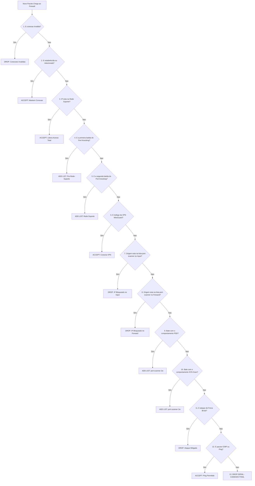

# 🗺️ Mapa de Fluxo do Firewall (Input & Forward)
{: .no_toc }

Este diagrama visual apresenta o ciclo de vida e a ordem de processamento sequencial de um pacote de rede ao passar pelas regras de filtro (Filter Rules) básicas e intermediárias do seu MikroTik.

---

### 📊 Diagrama de Fluxo (Ordem de Processamento Sequencial)

{: .note }
> O MikroTik processa as regras de cima para baixo. Assim que um pacote atinge um critério de **Drop** ou **Accept**, ele interrompe a leitura das regras seguintes.

[⬅️ Voltar para o Guia de Firewall Intermediário]({{ '/docs/seguranca/firewall-intermediario/' | relative_url }}){: .btn .btn-outline }